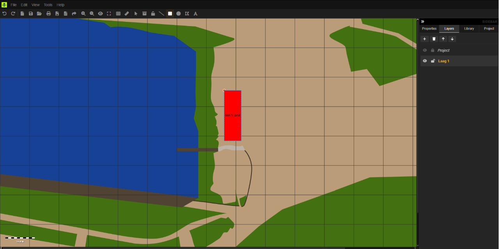

# SVG Maps - WebApp

**An SVG-based terrain editor for creating and editing 2D maps with customizable terrain features.**  

## Features
- **Multipe layers** - Support multiple layers and manage them in the sidebar 
- **SVG-based terrain editing** – Draw and modify terrain with vector precision  
- **Customizable heightmaps** – Adjust elevation data visually  
- **Texture & style controls** – Apply colors, patterns, and effects  
- **Grid & snapping tools** – Align elements with precision  
- **Real-time property editing** – Adjust terrain parameters without a save button  
- **Export to SVG/PNG** – Save maps for web or print  
- **Project Files (*.wmap) ** – Make projects, includes all content

## ToDo 
- [x] Layer support  
- [x] Undo/redo functionality
- [ ] Gallery
- [ ] Import galleries from store
- [ ] Layers tab; Show all elements in list below each layer (with show/hide,lock/unlock)
- [ ] Layers tab; right-click menu on for layers and elements
- [ ] Import GeoJSON data
- [ ] More drawing elements : Triangle, Star, pentagram enz.

## License  
MIT © 2025 STRAPATSEN 

---
